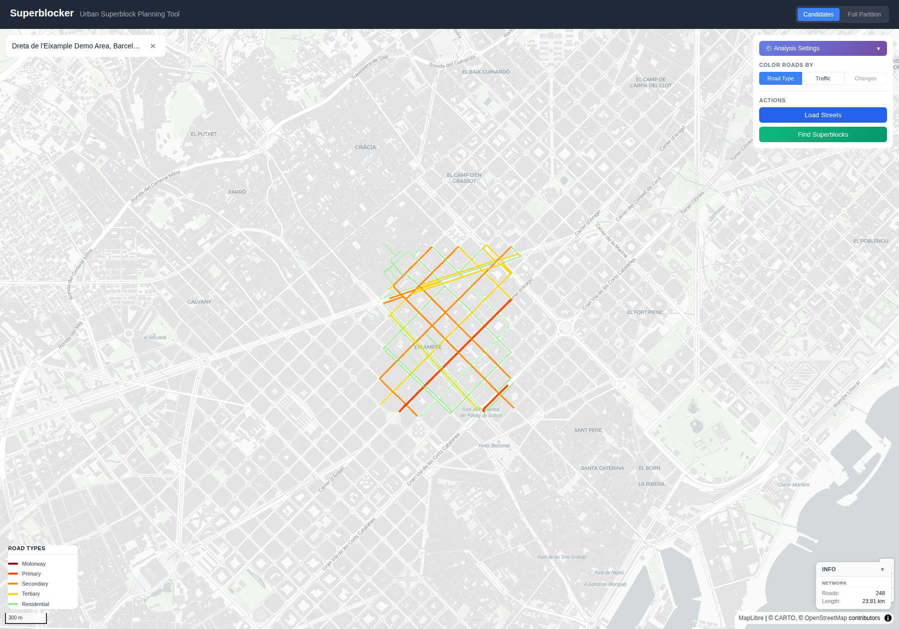
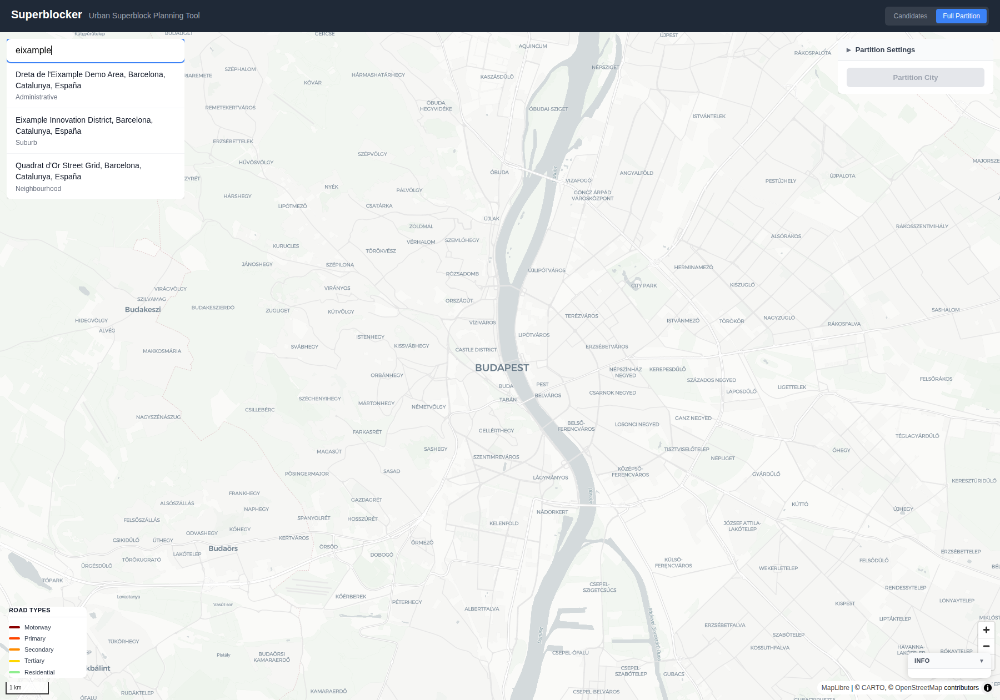
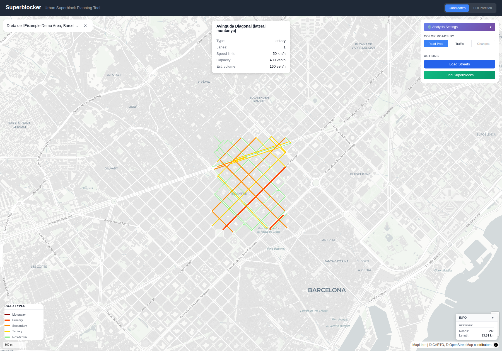
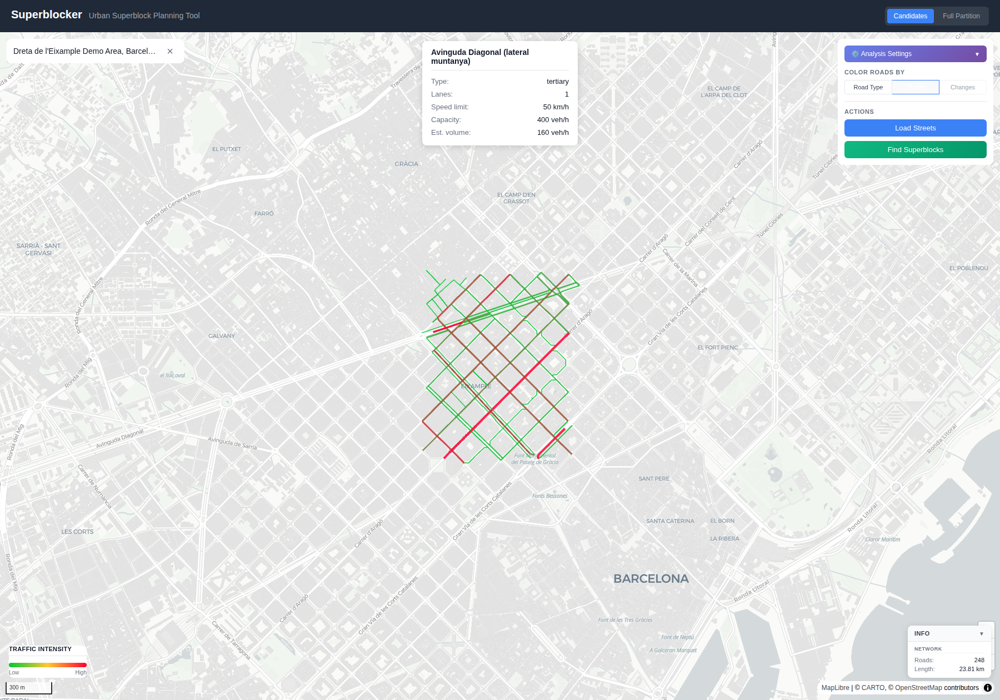
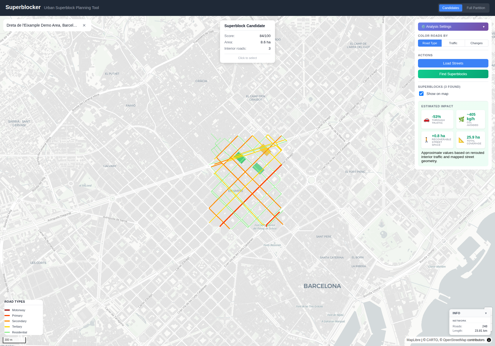
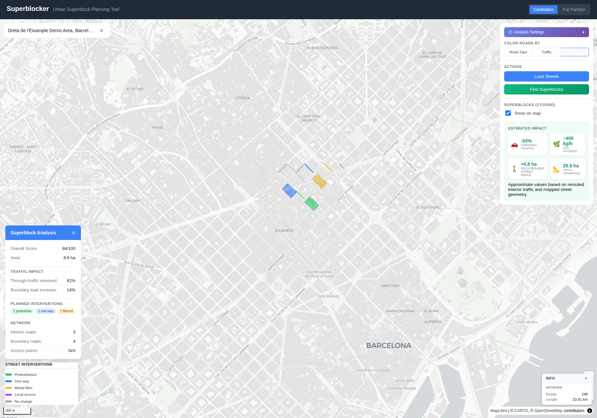
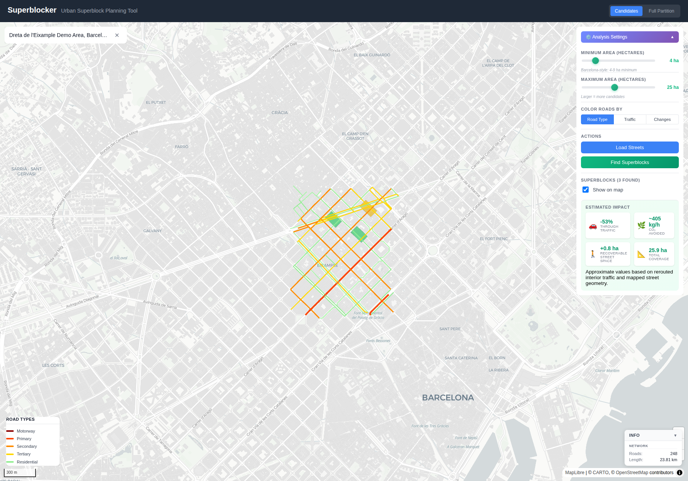
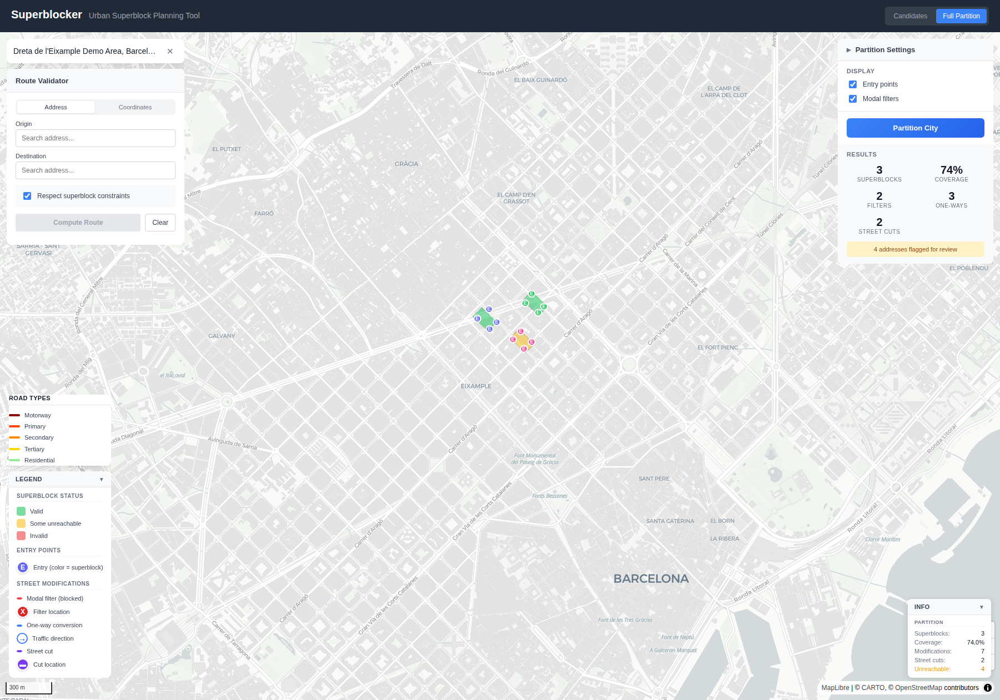
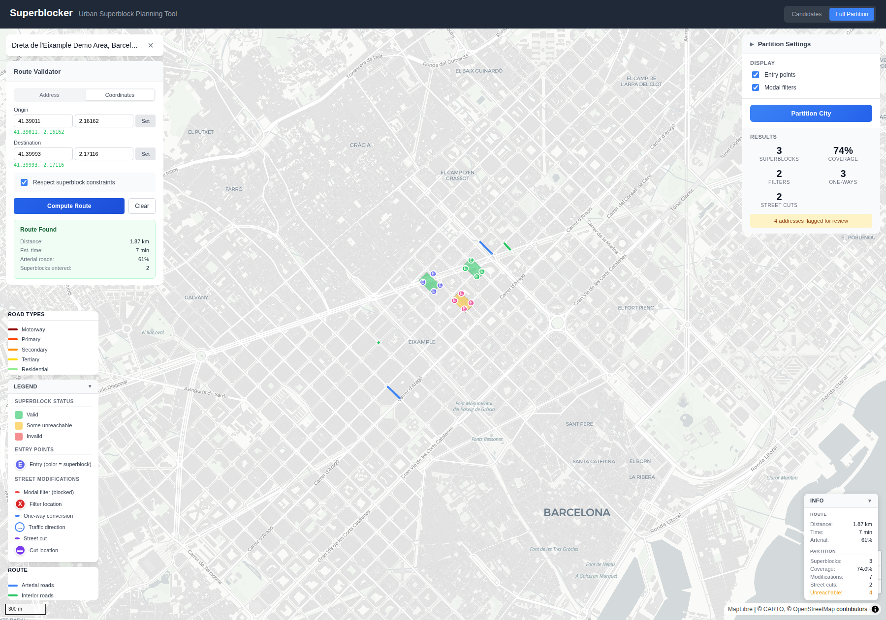

# Superblocker

A web application for identifying and visualizing potential superblocks in any city worldwide. Combines OpenStreetMap data with traffic modeling to help urban planners, researchers, and citizens explore pedestrian-friendly urban transformations.



## Features

### 🔍 City Search
Search and select any city or area worldwide using Nominatim geocoding. Results appear instantly as you type, with location type badges for easy identification.



### 🛣️ Street Network Visualization
Load the complete road network for any selected area. Roads are color-coded by classification — from motorways (red) down to residential streets (green) — with line width reflecting road importance.



### 🚦 Traffic Estimation
Switch to Traffic mode to see estimated traffic intensity across the network. A green-to-red heat gradient highlights congestion hot-spots based on road capacity, lane count, and speed limits.



### 🏙️ Superblock Detection & Impact Metrics
Run the analysis to automatically detect superblock candidates using centrality-based algorithms. View heuristic impact metrics including through-traffic reduction, avoided interior vehicle-kilometers / CO₂, and recoverable pedestrian street area.



### 🔄 Candidate Intervention Preview
Select a superblock candidate and switch to Changes mode to inspect pedestrianized streets, one-way conversions, and modal filters before moving to a full city-wide partition.



### ⚙️ Configurable Analysis
Fine-tune detection parameters such as minimum and maximum superblock area (Barcelona-style defaults: 4–25 ha). Toggle between Road Type, Traffic, and Changes color modes to compare the network, traffic intensity, and proposed interventions.



### 📐 Full City Partitioning
Go beyond individual candidates with the Full Partition mode. Generate a city-wide partitioning plan, inspect individual superblock details, and review entry points, modal filters, street cuts, one-way conversions, and accessibility warnings.



### 🚗 Route Validation
Validate routes against the generated partition using either address search or manual coordinates. Compare paths while respecting superblock constraints and review distance, travel time, arterial share, and traversed superblocks.



### Coming Soon

- Export to PDF/GeoJSON
- Real traffic count import for calibration

## Tech Stack

### Backend
- Python 3.11+ with FastAPI
- OSMnx for street network analysis
- NetworkX for graph algorithms
- GeoPandas/Shapely for geospatial operations

### Frontend
- React 18 with TypeScript
- deck.gl for high-performance map visualization
- react-map-gl for Mapbox integration
- TanStack Query for data fetching

## Getting Started

### Prerequisites

- Python 3.11+
- Node.js 18+
- npm or yarn

### Backend Setup

```bash
cd backend

# Create virtual environment
python -m venv venv
source venv/bin/activate  # On Windows: venv\Scripts\activate

# Install dependencies
pip install -r requirements.txt

# Copy environment file
cp .env.example .env

# Run the server
uvicorn app.main:app --reload
```

The API will be available at `http://localhost:8000`. API docs at `http://localhost:8000/docs`.

### Frontend Setup

```bash
cd frontend

# Install dependencies
npm install

# Copy environment file
cp .env.example .env

# Start development server
npm run dev
```

The app will be available at `http://localhost:5173`.

### Docker Setup (Alternative)

```bash
docker-compose up --build
```

This will start both backend and frontend services.

## Usage

1. **Search for a city**: Type a city name (e.g., "Barcelona", "Budapest") in the search box
2. **Select from results**: Click on a search result to zoom to that location
3. **Load street network**: Click "Load Street Network" to fetch road data from OpenStreetMap
4. **Explore the map**: Hover over roads to see details (name, type, capacity, traffic estimates)
5. **Analyze candidates**: Run the candidate workflow and review impact metrics plus proposed street changes
6. **Partition the city**: Generate a full partition with modal filters, street cuts, and entry points
7. **Validate routes**: Test origin-destination trips against the generated superblock plan

## API Endpoints

### Search
- `GET /api/v1/search?q={query}` - Search for places

### Analysis
- `POST /api/v1/network` - Fetch street network for a bounding box
- `POST /api/v1/analyze` - Analyze area for superblock candidates (coming soon)

### Cache Management
- `GET /api/v1/cache/stats` - Get cache statistics
- `DELETE /api/v1/cache?cache_type={type}` - Clear cache entries (optional type filter)
- `POST /api/v1/cache/cleanup` - Remove expired cache entries

## Caching

The application includes a robust caching system to improve performance by avoiding redundant API calls and computations.

### What is Cached

- **Street Network Data** (`network`): Downloaded road networks from OpenStreetMap (7 days TTL)
- **Analysis Results** (`analysis`): Superblock detection and analysis results (24 hours TTL)  
- **Search Results** (`search`): Nominatim geocoding search results (1 hour TTL)

### Configuration

Cache settings can be configured via environment variables:

| Variable | Default | Description |
|----------|---------|-------------|
| `CACHE_ENABLED` | `true` | Enable or disable caching |
| `CACHE_DIR` | `cache` | Directory for cache files |
| `CACHE_TTL_SECONDS` | `86400` | Default cache TTL (24 hours) |
| `CACHE_NETWORK_TTL_SECONDS` | `604800` | Network data TTL (7 days) |
| `CACHE_ANALYSIS_TTL_SECONDS` | `86400` | Analysis results TTL (24 hours) |
| `CACHE_SEARCH_TTL_SECONDS` | `3600` | Search results TTL (1 hour) |

### Cache Management

View cache statistics:
```bash
curl http://localhost:8000/api/v1/cache/stats
```

Clear all cache:
```bash
curl -X DELETE http://localhost:8000/api/v1/cache
```

Clear specific cache type:
```bash
curl -X DELETE "http://localhost:8000/api/v1/cache?cache_type=network"
```

Remove expired entries:
```bash
curl -X POST http://localhost:8000/api/v1/cache/cleanup
```

## Project Structure

```
superblocker/
├── backend/
│   ├── app/
│   │   ├── main.py              # FastAPI app entry
│   │   ├── api/routes/          # API endpoints
│   │   ├── core/                # Configuration
│   │   ├── models/              # Pydantic schemas
│   │   ├── services/            # Business logic
│   │   │   └── cache_service.py # Caching system
│   │   └── utils/               # Utilities
│   └── requirements.txt
├── frontend/
│   ├── src/
│   │   ├── components/          # React components
│   │   ├── hooks/               # Custom hooks
│   │   ├── services/            # API client
│   │   └── types/               # TypeScript types
│   └── package.json
└── docker-compose.yml
```

## Configuration

### Backend (.env)
- `DEBUG` - Enable debug mode
- `CORS_ORIGINS` - Allowed CORS origins
- `NOMINATIM_USER_AGENT` - User agent for Nominatim requests
- `CACHE_ENABLED` - Enable/disable caching (default: true)
- `CACHE_DIR` - Cache directory path (default: cache)
- `CACHE_*_TTL_SECONDS` - TTL settings for different cache types

### Frontend (.env)
- `VITE_API_URL` - Backend API URL
- `VITE_MAPBOX_TOKEN` - Optional Mapbox token for premium basemaps

## License

GPL-3.0 - See [LICENSE](LICENSE) for details.

## Contributing

Contributions are welcome! Please feel free to submit a Pull Request.
