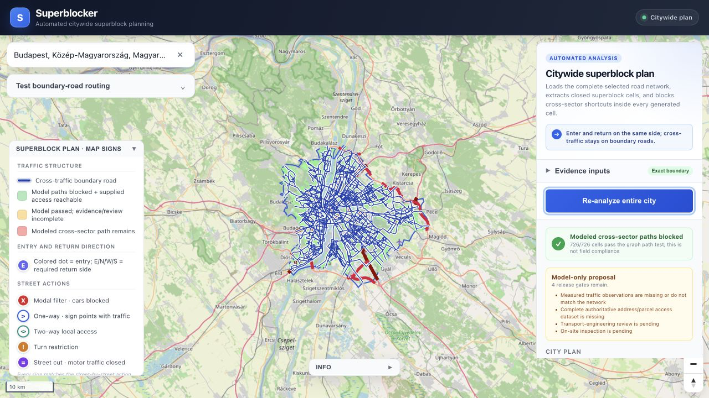
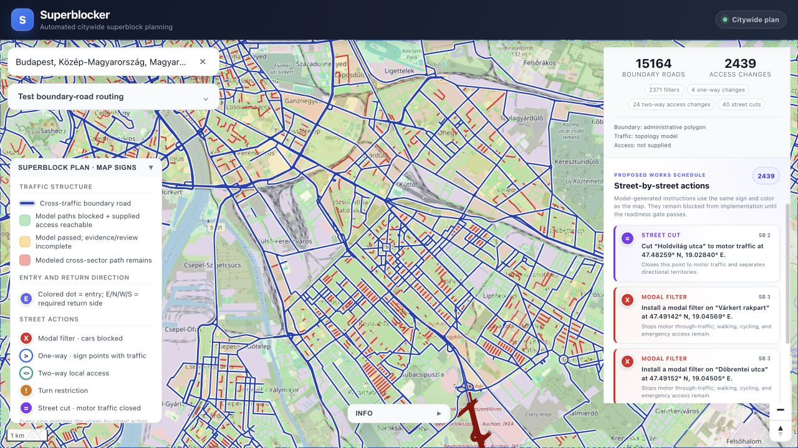
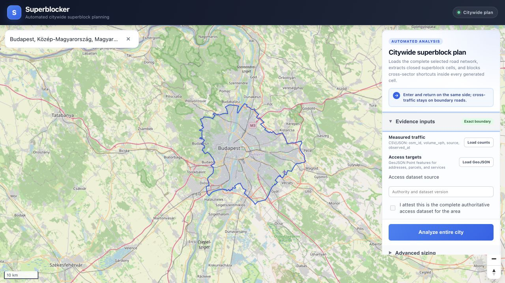

# Superblocker

Superblocker is a street-network planning prototype. It loads the OpenStreetMap driving graph inside a selected place's administrative polygon, detects a boundary-road network, builds closed road cells, and proposes access changes that prevent modeled vehicle paths from crossing between different entry sides of each generated cell.

Every result carries machine-readable evidence provenance and a release gate. A model run cannot be labeled `implementation_ready` until it uses an exact boundary, matched measured traffic observations, a complete authoritative access-target dataset, and recorded transport-engineering and on-site reviews.



## How the analysis works

1. **Select an area.** Search asks OpenStreetMap Nominatim for the result's GeoJSON. Polygon and multipolygon administrative boundaries are validated and propagated into the analysis. The bounding box is used for map fitting and only as a labeled fallback when no polygon exists.
2. **Load the road graph.** The backend calls OSMnx with the exact polygon and normalizes road attributes.
3. **Load evidence.** The UI accepts measured traffic counts keyed by OSM way ID and GeoJSON Point access targets from an address, parcel, building, delivery, or emergency-service dataset.
4. **Find boundary roads.** When matching observations are supplied, the measured volume distribution selects the boundary network. Without them, the road-class/centrality fallback remains available but the result is tagged `modeled_topology` and blocked from implementation.
5. **Build road cells.** Closed rings in the boundary network are polygonized, clipped to the administrative geometry, filtered, and merged toward the configured target area.
6. **Assign entry sides.** Each generated cell gets four cardinal entry/return sectors: east, north, west, and south.
7. **Block cross-sector paths.** The constraint solver proposes modal filters, one-way changes, street cuts, and local two-way repairs. A connectivity-preserving directional-territory fallback is used when a cheaper cut plan would remove existing access.
8. **Validate separate claims.** The graph test checks only cross-sector vehicle paths. Supplied access targets are independently snapped to the interior road graph and checked for both an inbound and return path. Neither result is called real-world compliance.
9. **Apply the release gate.** `implementation_ready` requires all model checks, complete evidence, a transport-engineering attestation, and an on-site inspection attestation. Otherwise the API returns the exact blockers.
10. **Render and inspect.** MapLibre displays OpenStreetMap raster tiles; deck.gl displays the road graph, cell polygons, boundary roads, entry points, access signs, and test routes.

All action markers use the same symbols in the map legend, hover tooltip, selected-cell details, and implementation schedule:

| Sign | Meaning |
| --- | --- |
| Blue line | Boundary road carrying cross-traffic between cells |
| Colored dot / `E N W S` | Entry point and required return side |
| Red `X` | Modal filter; motor through-traffic blocked |
| Blue `>` | One-way conversion in the shown direction |
| Teal `<>` | Two-way local-access repair |
| Amber `!` | Turn restriction |
| Purple `=` | Full motor-traffic closure / street cut |

Point signs are hidden at city scale and appear from street-level zoom to avoid covering the road network. The proposed-works schedule initially renders 50 actions and can load further batches without creating thousands of DOM elements at once.



## Budapest verification run

Observed in the local app on 2026-08-31 with the default 12 ha target, 6 ha minimum, 20 ha maximum, four entry sectors, the exact Nominatim administrative polygon, and no external traffic/access evidence:

| Result | Value |
| --- | ---: |
| Selected extent | Exact Budapest administrative polygon |
| Input graph | 24,525 nodes; 64,026 directed edges |
| Rendered road network | 37,406 physical segments; 4,743.65 km |
| Generated superblocks | 726 |
| Generated-cell coverage | 34.7% of the administrative-polygon area |
| Boundary-road OSM IDs | 15,164 |
| Street actions | 2,439 |
| Modal filters | 2,371 |
| One-way changes | 4 |
| Two-way local-access repairs | 24 |
| Street cuts | 40 |
| Modeled directional path test | 726 / 726 generated cells passed |
| Evidence status | Exact boundary; topology traffic fallback; no access dataset |
| Release status | `model_only`; four blockers returned |
| OSM graph retrieval | 25.6 seconds on the test machine |
| Partition processing | 14.6 seconds on the test machine |
| End-to-end run | About 41 seconds on the test machine |

The prior rectangular pipeline spent 670.4 seconds in partition processing on a larger 32,734-node graph. The current 14.6-second figure is the measured polygon-clipped processing time, not an estimate. Coverage is still not a wall-to-wall land-use partition: it is the union of accepted closed road cells divided by the administrative area.

## Evidence inputs

Traffic CSV must contain `osm_id,volume_vph,source,observed_at`. JSON may contain the equivalent array of objects. `volume_vph` is the measured vehicles-per-hour value for the observation period.

Measured data must match at least 80% of physical road length before it can satisfy the implementation gate. Sparse observations still drive the measured-volume arterial mode, but the returned readiness blockers state the actual coverage shortfall.

Reference files: [`examples/traffic-observations.csv`](examples/traffic-observations.csv) and [`examples/access-targets.geojson`](examples/access-targets.geojson).

Access data must be a GeoJSON `FeatureCollection` of `Point` features. Each feature may provide `id`, `kind`, and `label`; `kind` is one of `address`, `parcel`, `building`, `emergency`, or `delivery`. The operator must name the source and explicitly attest that the uploaded set is complete before it can satisfy the authoritative-access gate.



After generation, the API assigns a SHA-256 `plan_id` over the immutable plan contents. `POST /partition/review` accepts attestations for `transport_engineering` and `site_inspection`, and rejects reviews whose `plan_id` does not match the submitted partition. Each attestation records the reviewer, organization, review date, and reference. The presence of an attestation is auditable input provenance; the software does not invent, infer, or authenticate professional credentials.

City-scale geometry work now uses one projected-area transformer per run, a Shapely edge index for cell classification, and a spatial index for cell adjacency. Large topology-fallback runs cap approximate centrality sampling at 128 nodes; measured-volume runs skip centrality entirely.

## Interface

The right-hand planner runs one workflow: **Analyze entire city**. Results include:

- model-path status, evidence provenance, release blockers, and administrative-boundary coverage;
- the boundary-road network reserved for cross-traffic;
- counts for every access-change type;
- a street-by-street action schedule with street name and coordinates;
- a warning when a supplied address/parcel/service target loses inbound or return access;
- display toggles for entry directions and street actions;
- a route tester that sends inter-cell travel onto boundary roads.

The basemap defaults to OpenStreetMap's no-key raster endpoint. Set `VITE_OSM_TILE_URL` to use another OSM-compatible raster tile service in a deployment.

## Architecture

### Backend

- Python 3.12 and FastAPI
- OSMnx, NetworkX, GeoPandas, Shapely, and PyProj
- server-sent events for progress
- bounded analysis worker pool and per-client request limits
- atomic file-cache writes and bounded in-memory partition cache

### Frontend

- React 19, TypeScript, and Vite
- MapLibre for OpenStreetMap raster tiles
- deck.gl for road, polygon, marker, and route layers
- same-origin `/api` proxy in development and nginx production builds

## Local development

Prerequisites: Python 3.12, Node.js 22, and npm.

Backend:

```bash
cd backend
python3.12 -m venv .venv
source .venv/bin/activate
python -m pip install -r requirements-dev.txt
cp .env.example .env
uvicorn app.main:app --reload
```

Frontend, in a second terminal:

```bash
cd frontend
npm ci
cp .env.example .env
npm run dev
```

Open `http://localhost:5173`. API documentation is at `http://localhost:8000/docs`.

## Docker Compose

```bash
docker compose up --build
```

Open `http://localhost:5173`. The frontend nginx container proxies API and SSE traffic to the non-root backend container. The backend port is intentionally not published to the host.

## Configuration

Copy [`backend/.env.example`](backend/.env.example) and [`frontend/.env.example`](frontend/.env.example).

| Variable | Default | Purpose |
| --- | --- | --- |
| `VITE_API_URL` | `/api/v1` | Backend API base URL |
| `VITE_OSM_TILE_URL` | `https://tile.openstreetmap.org/{z}/{x}/{y}.png` | Raster basemap template |
| `NOMINATIM_USER_AGENT` | project identifier | Identifies geocoder requests |
| `NOMINATIM_MIN_INTERVAL_SECONDS` | `1.0` | Aggregate geocoder throttle |
| `MAX_BBOX_SPAN_DEGREES` | `0.5` | Maximum latitude/longitude span |
| `MAX_BBOX_AREA_KM2` | `2500` | Maximum approximate bbox area |
| `ANALYSIS_MAX_WORKERS` | `2` | Graph-analysis worker count |
| `ANALYSIS_MAX_CONCURRENT_REQUESTS` | `2` | Concurrent expensive requests |
| `ANALYSIS_RATE_LIMIT_PER_MINUTE` | `6` | Per-client expensive-request limit |
| `PARTITION_CACHE_MAX_ENTRIES` | `8` | In-process partition cache size |
| `PARTITION_CACHE_TTL_SECONDS` | `3600` | Partition cache lifetime |
| `ADMIN_API_KEY` | unset | Enables authenticated cache maintenance |

## API

All application endpoints are under `/api/v1`:

| Method | Endpoint | Purpose |
| --- | --- | --- |
| `GET` | `/search` | Nominatim place search |
| `GET` | `/search/reverse` | Reverse geocoding |
| `POST` | `/network` | Download and classify a street network |
| `POST` | `/analyze` | Legacy candidate-analysis compatibility endpoint |
| `POST` | `/analyze/stream` | Legacy candidate analysis with SSE progress |
| `POST` | `/partition` | Generate a partition and road network |
| `POST` | `/partition/stream` | Generate a partition with SSE progress |
| `POST` | `/partition/review` | Apply both post-analysis review attestations to an exact plan ID |
| `POST` | `/route` | Route with an optional supplied partition |
| `GET` | `/optimize/size` | Recommend a target size |
| `GET` | `/cache/stats` | Return non-sensitive cache statistics |
| `DELETE` | `/cache` | Clear cache entries; requires `X-Admin-Key` |
| `POST` | `/cache/cleanup` | Remove expired entries; requires `X-Admin-Key` |

`GET /health` is the unauthenticated health check.

## Quality checks

```bash
cd backend
.venv/bin/ruff check app tests
.venv/bin/ruff format --check app tests
.venv/bin/pytest
.venv/bin/pip-audit -r requirements.txt

cd ../frontend
npm test -- --run
npm run lint
npm run build
npm audit
```

## License

GPL-3.0. See [LICENSE](LICENSE).
